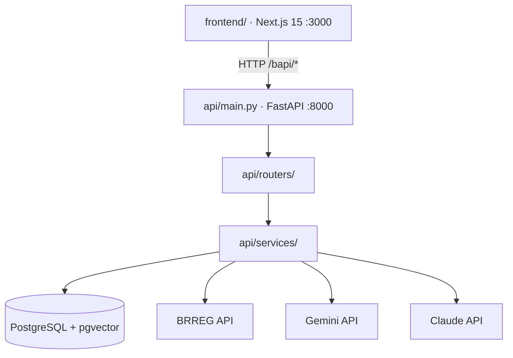

# Broker Accelerator — Developer Reference

> **User-facing docs** (setup, features, workflow, deployment): see `README.md`.
> **API reference**: auto-generated OpenAPI at `http://localhost:8000/docs`.
> This file covers architecture, patterns, and non-obvious helpers for contributors.

---

## Developer Setup

1. Install Claude Code (once per machine — **not** a pip package, install globally):
   ```bash
   npm install -g @anthropic-ai/claude-code
   # or on macOS:
   brew install claude-code
   claude --version   # verify
   ```

2. Install the Antire Claude plugin (once per machine):
   ```bash
   bash scripts/install-antire-plugin.sh
   ```
3. Restart Claude Code.
4. At the start of each Claude Code session, run `/antire-python-init` to load Antire coding standards.

---

## Architecture



The legacy Streamlit `ui/` was deleted on 2026-04-08 once the Next.js frontend reached feature parity. See the git history for the migration story.

Sequence diagrams for key flows (PlantUML — render with IntelliJ, VS Code PlantUML extension, or [plantuml.com](https://www.plantuml.com/plantuml)):
- [`docs/company_lookup_flow.puml`](docs/company_lookup_flow.puml) — `GET /org/{orgnr}` end-to-end
- [`docs/pdf_extraction_flow.puml`](docs/pdf_extraction_flow.puml) — agentic IR discovery + PDF extraction

Class diagrams (auto-generated from source):
```bash
bash scripts/gen_diagrams.sh   # writes docs/classes.mmd + docs/packages.mmd
```

```
api/
  main.py          ← entry point; reads ALL env vars; configures DI container
  container.py     ← punq ContainerFactory; registers ports → adapters
  ports/
    driven/        ← Abstract port interfaces (ABCs) for outbound dependencies
      blob_storage_port.py    BlobStoragePort
      notification_port.py    NotificationPort
  adapters/        ← Concrete port implementations; no os.getenv(); inject Config
      blob_storage_adapter.py  AzureBlobStorageAdapter + BlobStorageConfig
      notification_adapter.py  AzureEmailNotificationAdapter + NotificationConfig
  use_cases/       ← Pure business logic; no FastAPI/DB/LLM imports
      insurance_needs.py       estimate_insurance_needs() + rule engine
  routers/         ← HTTP layer (validate → call service/use_case → return response)
    broker.py      broker settings + notes (uses BrokerService)
    company.py     /org/{orgnr}, /search, /companies
    financials.py  /org/{orgnr}/pdf-history, /pdf-sources, /history
    knowledge.py   /org/{orgnr}/chat (RAG/chat); /knowledge/chat; /knowledge/index
    offers.py      insurance offer upload + comparison
    risk_router.py risk narrative + structure endpoints
    sla.py         SLA agreement endpoints (uses SlaService)
    documents.py   InsuranceDocument endpoints
    utils.py       org-enrichment endpoints (roles, estimate, bankruptcy, koordinater, benchmark, struktur, norgesbank)
    admin_router.py admin CRUD + debug/status + dashboard + portfolio-digest + activity-reminders
  services/        ← Business logic (Phase 2 migration target) + legacy wrappers
    broker.py      BrokerService  (db in __init__)
    sla_service.py SlaService     (db in __init__)
    pdf_sources.py PdfSourcesService + backward-compat functions
    documents.py   DocumentService + backward-compat functions
    rag.py         RagService     + backward-compat functions
    llm.py         LlmService     + module-level helpers
    external_apis.py ExternalApiService + module-level helpers
    company.py     CompanyService + module-level helpers
    pdf_extract.py backward-compat re-export shim (imports from pdf_parse/history/web/agents/background)
    pdf_parse.py   JSON parsing, Gemini extraction, pdfplumber fallback
    pdf_history.py DB upsert, history merge (BRREG + PDF rows)
    pdf_web.py     DuckDuckGo helpers, HTML fetching (Playwright + requests fallback)
    pdf_agents.py  Claude / Gemini / Azure OpenAI agent loops + orchestration
    pdf_background.py URL validation, parallel extraction, PdfExtractService
    pdf_generate.py PdfGenerateService + module-level helpers
    blob_storage.py   BlobStorageService (legacy wrapper → AzureBlobStorageAdapter)
    notification_service.py  NotificationService (legacy wrapper → adapter)
    insurance_needs.py  re-export from api.use_cases.insurance_needs
  domain/
    exceptions.py  NotFoundError, QuotaError, LlmUnavailableError,
                   PdfExtractionError, ExternalApiError
  db.py / risk.py / constants.py / prompts.py / schemas.py

frontend/        ← Next.js 15 app (Pages Router on /bapi/* rewrites)
  src/app/       ← all routes (dashboard, search, portfolio, renewals, etc.)
  src/components/ ← reusable React components
  src/lib/       ← API client (api.ts), generated types (api-schema.ts)
  next.config.ts ← server-side rewrites /bapi/* → ${API_BASE_URL}/*
  package.json   ← npm scripts (dev, build, gen:api-types)
```

---

## Clean Code Principles Followed

- **Hexagonal architecture (Phase 1)** — outbound infrastructure is behind `ports/driven/` ABCs; implementations live in `adapters/`; pure logic in `use_cases/`. DI wired via `container.py` (punq). Phase 2 will migrate remaining services.
- **Env vars only in `main.py`** — adapters accept frozen-dataclass Config objects; only `main.py` calls `os.getenv()`. Legacy wrappers in `services/` bridge Phase 1→2.
- **Port injection via `Depends()`** — routers resolve ports from the container using factory functions (`_get_notification`, etc.) rather than instantiating adapters directly.
- **No HTTPException in services** — services raise domain exceptions (`QuotaError`, `NotFoundError`, etc.); routers catch and convert to HTTP status codes
- **No DB writes in routers** — all `db.add()` / `db.commit()` calls live in services; routers never touch ORM objects directly
- **No LLM calls in routers** — all Gemini/Claude API calls are in `services/llm.py`; routers call service helpers
- **Service classes own one domain** — each `*Service` class takes `db: Session` in `__init__` and exposes clean methods. Inject via `Depends()` in routers.
- **Backward-compat module functions** — `pdf_sources.py`, `documents.py`, `rag.py` expose both the class and standalone functions (same signature as before) so internal callers don't break
- **Functions ≤ 40 lines** — long functions decomposed into named helpers; the two agent loops (`_agent_discover_pdfs_claude`, `_agent_discover_pdfs_gemini`) are ~70 lines but justified by tool-use loop logic
- **Parallel extraction** — `_extract_pending_sources` uses `ThreadPoolExecutor(max_workers=3)`; each thread gets its own DB session
- **Testable background tasks** — `_auto_extract_pdf_sources(db_factory=SessionLocal)` accepts injected session factory
- **Graceful degradation** — Playwright fails → requests fallback; agent fails → DuckDuckGo fallback; BRREG empty → PDF history fallback; no LLM key → silent skip
- **Multi-key Gemini rotation** — `_gemini_api_keys()` reads `GEMINI_API_KEY`, `GEMINI_API_KEY_2`, `GEMINI_API_KEY_3`; all Gemini calls rotate through keys on 429/quota errors

---

## Architecture Deviations (intentional)

The following are intentional deviations from Antire Python standards — documented here so future contributors understand the reasoning:

| Deviation | Antire Standard | Why we deviate |
|-----------|----------------|----------------|
| **Env vars read in some services** | All `os.getenv` in `main.py` only | LLM keys are optional and read lazily — services check `_is_key_set()` at call time and gracefully skip missing keys; centralising them in `main.py` would require plumbing optional config through every service constructor. Phase 1 hexagonal migration owns blob + notification; remaining services are Phase 2. |
| **High-complexity agent loops** | All functions ≤ cyclomatic C (10) | `_agent_discover_pdfs_*` are tool-use state machines; branching reflects the multi-turn protocol, not accidental complexity |

---

## Ports, Adapters, and Use Cases

| Type | Class | File | Notes |
|------|-------|------|-------|
| Port (ABC) | `BlobStoragePort` | `api/ports/driven/blob_storage_port.py` | Abstract blob storage interface |
| Port (ABC) | `NotificationPort` | `api/ports/driven/notification_port.py` | Abstract email notification interface |
| Adapter | `AzureBlobStorageAdapter` | `api/adapters/blob_storage_adapter.py` | Azure Blob Storage; takes `BlobStorageConfig` |
| Adapter | `AzureEmailNotificationAdapter` | `api/adapters/notification_adapter.py` | Azure Communication Services; takes `NotificationConfig` |
| Use Case | `estimate_insurance_needs` | `api/use_cases/insurance_needs.py` | Pure rule engine — no I/O, no DB |

## Service Classes

| Class | File | Key Methods |
|-------|------|-------------|
| `BrokerService` | `api/services/broker.py` | `get_settings`, `save_settings`, `list_notes`, `create_note`, `delete_note` |
| `SlaService` | `api/services/sla_service.py` | `create_agreement` |
| `PdfSourcesService` | `api/services/pdf_sources.py` | `upsert_pdf_source`, `save_insurance_document`, `delete_history_year` |
| `DocumentService` | `api/services/documents.py` | `store_document`, `remove_document`, `save_offers`, `remove_offer`, `get_document_keypoints`, `answer_document_question`, `compare_two_documents` |
| `RagService` | `api/services/rag.py` | `chunk_and_store`, `retrieve_chunks`, `save_qa_note`, `save_to_rag` |
| `LlmService` | `api/services/llm.py` | `embed`, `answer_raw`, `answer`, `compare_offers`, `parse_json` |
| `ExternalApiService` | `api/services/external_apis.py` | `search`, `fetch_enhet`, `fetch_regnskap`, `pep_screen`, `fetch_koordinater`, `fetch_board_members`, `fetch_ssb_benchmark` |
| `CompanyService` | `api/services/company.py` | `fetch_org_profile`, `list_companies`, `seed_pdf_sources` |
| `PdfExtractService` | `api/services/pdf_extract.py` | `fetch_history_from_pdf`, `get_full_history`, `parse_financials_from_pdf` |
| `PdfGenerateService` | `api/services/pdf_generate.py` | `generate_sla`, `generate_risk_report`, `generate_forsikringstilbud` |

---

## Key Private Helpers (non-obvious)

| Helper | File | Purpose |
|--------|------|---------|
| `_is_key_set(key)` | `api/services/llm.py` | Returns True only if key is set and not `"your_key_here"` — used before every LLM call |
| `_gemini_generate_with_fallback(parts, timeout)` | `api/services/llm.py` | Shared Gemini model loop: tries `gemini-2.5-flash` → `gemini-1.5-flash` → `GEMINI_MODEL`; used by `_analyze_document_with_gemini`, `_compare_documents_with_gemini`, `_compare_offers_with_llm` |
| `_org_dict_from_db(db_obj)` | `api/routers/risk_router.py` | Builds the `org` dict from a `Company` ORM object — used by all three risk endpoints to avoid duplication |
| `save_insurance_document(orgnr, navn, filename, pdf_bytes, db)` | `api/services/pdf_sources.py` | Persists a generated forsikringstilbud PDF as an `InsuranceDocument` row — keeps DB writes out of the router |
| `_build_company_context(db_obj, notes)` | `api/services/rag.py` | Builds structured text context for the LLM from a `Company` ORM object + retrieved notes |

---

## Files

### [api/main.py](api/main.py) — FastAPI entry point

Mounts all routers. On startup: runs Alembic migrations, calls `init_db()` + `_seed_pdf_sources()`, and configures the DI container. This is the **only** file that calls `os.getenv()` for infrastructure env vars (blob endpoint, ACS connection string). Contains no business logic.

### [api/routers/](api/routers/) — HTTP layer

Each router handles one domain. Routers only: validate input → instantiate service → call method → return response. They catch domain exceptions and convert to HTTPException.

Service injection pattern used in broker.py and sla.py:
```python
def _get_broker_service(db: Session = Depends(get_db)) -> BrokerService:
    return BrokerService(db)

@router.get("/broker/settings")
def get_settings(svc: BrokerService = Depends(_get_broker_service)):
    ...
```

### [api/services/pdf_extract.py](api/services/pdf_extract.py) — PDF discovery + extraction

**Agentic IR discovery pipeline:**
1. `_agent_discover_pdfs(orgnr, navn, hjemmeside, target_years)` — tries Claude first (`ANTHROPIC_API_KEY`), then all Gemini keys in order
2. `_agent_discover_pdfs_claude` — Claude tool-use loop using native `web_search_20250305` + custom `fetch_url` (Playwright-backed)
3. `_agent_discover_pdfs_gemini` — two-phase Gemini loop:
   - Phase 1: `gemini-2.5-flash` Google Search grounding → finds IR page URL
   - Phase 2: `_run_gemini_phase2(chat, navn, phase1_text)` — up to 4 `fetch_url` turns to extract real `pdf_links`
4. `_validate_pdf_urls(discovered)` — HTTP HEAD check; filters out 404/unreachable URLs before storing
5. `_fetch_html(url)` — Playwright (headless Chromium) → requests fallback

**Extraction pipeline:**
- `_parse_financials_from_pdf(pdf_url, orgnr, year)` — Gemini native PDF (inline ≤18MB, Files API >18MB); pdfplumber fallback
- `fetch_history_from_pdf(orgnr, pdf_url, year, label, db)` — orchestrates extraction → upsert into `company_history`
- `_extract_pending_sources(orgnr, sources, db)` — parallel extraction (3 workers, own DB session per thread)
- `_auto_extract_pdf_sources(orgnr, org, db_factory)` — background task; re-runs discovery if ≥3 of last 5 years missing

### [api/services/external_apis.py](api/services/external_apis.py)

**External data sources:**

| Source | What it provides | Auth |
|--------|-----------------|------|
| BRREG Enhetsregisteret | Company registry — name, org form, address, industry code, bankruptcy flags | None |
| BRREG Regnskapsregisteret | Financial statements (P&L + balance sheet) | None |
| Finanstilsynet | Financial licences held by the company | None |
| OpenSanctions | PEP / sanctions screening by name | None |
| Kartverket Geonorge | Geocoding Norwegian addresses to lat/lon | None |
| Løsøreregisteret | Asset encumbrances (pledges on movable assets) | Maskinporten (returns auth_required if missing) |

**API endpoints**: See `http://localhost:8000/docs` for the full auto-generated reference.

### [frontend/](frontend/) — Next.js 15 frontend

Replaces the legacy Streamlit `ui/` (deleted 2026-04-08). Routes live under `frontend/src/app/` and use Next.js's app router. The browser only ever talks to `/bapi/*`, which `next.config.ts` rewrites server-side to `${API_BASE_URL}/*` (the FastAPI backend) — this avoids CORS, hides the backend URL from the browser, and makes the API URL a runtime env var instead of a build-time constant.

**Top-level pages** (`frontend/src/app/`):
- `/dashboard` — landing page with key metrics
- `/search` + `/search/[orgnr]` — company search and full profile (6 tabs: oversikt, økonomi, forsikring, crm, notater, chat)
- `/portfolio` + `/portfolio/[id]` + `/portfolio/analytics` — portfolio list, detail, and 5-tab analytics
- `/renewals` — upcoming policy renewals
- `/sla` — SLA agreement generator
- `/pipeline` — deal kanban (drag-and-drop)
- `/knowledge` — RAG chat + semantic search + document/video management
- `/idd` + `/insurers` + `/recommendations` + `/prospecting` — feature pages
- `/portal/[token]` — token-based client view (no auth required)
- `/admin` — admin panel (users, exports, data controls, audit log)

**Type safety end-to-end**: API response types are auto-generated from Pydantic via `npm run gen:api-types` (runs `scripts/dump_openapi.py` + `openapi-typescript`). The result is committed to `frontend/src/lib/api-schema.ts` and CI verifies it's fresh on every PR via the `api-types-fresh` job.

### [api/risk.py](api/risk.py) — Risk scoring

- `derive_simple_risk(org, regn, pep)` — rule-based score + reasons list
- `build_risk_summary(org, regn, risk, pep)` — flat summary dict for UI metrics

### [api/db.py](api/db.py) — SQLAlchemy models

Nine tables: `companies`, `company_history`, `company_pdf_sources`, `company_notes`, `company_chunks`, `broker_settings`, `broker_notes`, `sla_agreements`, `insurance_offers`, `insurance_documents`.

`DATABASE_URL` is read from the environment; falls back to `postgresql://tharusan@localhost:5432/brokerdb`.

---

## Deployment / CD flow

```
feature branch
    → PR to staging  (CI: tests + lint)
    → merge to staging → staging deploy → smoke test /ping
    → validate manually on staging URL
    → PR to main  (CI: tests + lint again)
    → merge to main → prod deploy → smoke test /ping
```

Both `staging` and `main` pushes run the same `deploy.yml` workflow.
CI (`ci.yml`) now runs on PRs to **both** `staging` and `main`.

**Infra changes** (new Azure resources, OIDC config): run `terraform apply` locally from `infra/terraform/`
— Terraform is NOT part of CI/CD. See `infra/README.md` for details.

---

## Running locally

**Primary (full stack — logs preserved, matches prod environment):**
```bash
docker compose up           # first time: docker compose up --build
docker compose down         # stop everything
```

**Individual services (native hot-reload, separate terminals):**
```bash
bash scripts/run_api.sh                # FastAPI on http://localhost:8000
cd frontend && npm run dev             # Next.js on http://localhost:3000
# Note: you must have Postgres running separately (docker compose up postgres -d)
```

**Tests:**
```bash
uv run python -m pytest tests/unit -v              # fast, no infrastructure needed
uv run python -m pytest tests/unit tests/integration -v   # needs Postgres
```

With Docker:
```bash
docker compose up --build
```

---

## LLM / Model Configuration

The app uses a priority-based fallback for all LLM calls:

**Agentic IR discovery** (`_agent_discover_pdfs`):
1. Claude tool-use loop (`ANTHROPIC_API_KEY`) — preferred
2. Gemini tool-use loop (`GEMINI_API_KEY`) — fallback
3. DuckDuckGo + LLM validation — last resort

**PDF extraction** (`_parse_financials_from_pdf`):
1. `gemini-2.5-flash` (primary — multimodal, reads PDF natively)
2. `gemini-1.5-flash` (fallback)
3. pdfplumber text extraction → text LLM (last resort)

**Text generation** (`_llm_answer_raw`):
1. Claude (`ANTHROPIC_API_KEY`) if set
2. `gemini-2.5-flash`, then older Gemini/Gemma models

**Embeddings** (`_embed`):
1. Voyage AI (`VOYAGE_API_KEY`) if set
2. `text-embedding-004` via Gemini

Configure via environment variables: `ANTHROPIC_API_KEY`, `GEMINI_API_KEY`, `VOYAGE_API_KEY`.

---

## PDF Seed Data

`PDF_SEED_DATA` in `api/constants.py` contains confirmed direct PDF URLs for demo companies. Seeded on every startup (true upsert). Currently covers:

| Company | Orgnr | Years |
|---------|-------|-------|
| DNB Bank ASA | 984851006 | 2019–2024 |
| Gjensidige Forsikring ASA | 995568217 | 2019–2024 |
| Søderberg & Partners Norge AS | 979981344 | 2023 (SEK, group report) |
| Equinor ASA | 923609016 | 2024 (Sanity CDN; 46 MB → Files API) |

PDF extraction is **one-time per year** — once stored in `company_history` it is never re-fetched. To force re-extraction, delete the row from `company_history` and visit the profile.

---

## Frontend ↔ backend type sync

The frontend imports its API response types from a generated file, **not** hand-written interfaces. This is the safety net for the silent field-name mismatch bug class — if a backend field is renamed and the frontend is not updated, CI fails the PR with a concrete diff.

```
api/schemas.py                          ← single source of truth (Pydantic)
  ↓ FastAPI's app.openapi() walks routes
scripts/dump_openapi.py                 ← Python: dumps schema to JSON
  ↓
frontend/src/lib/openapi-schema.json    ← intermediate (gitignored)
  ↓ openapi-typescript codegen
frontend/src/lib/api-schema.ts          ← committed; consumers import from here
  ↓
frontend/src/lib/api.ts                 ← wrappers re-export the generated types
```

**To regenerate after a backend response model change:**
```bash
cd frontend
npm run gen:api-types       # runs scripts/dump_openapi.py + openapi-typescript
git add src/lib/api-schema.ts
```

**CI verifies it's fresh** via the `api-types-fresh` job in `.github/workflows/ci.yml`. If you rename a field in `api/schemas.py` and forget the codegen step, the PR fails with a diff like `under_avvikling → under_dissolution`.

**Adding new typed endpoints** — for any router endpoint the frontend reads, add `response_model=SomethingOut` to the decorator and define `SomethingOut` in `api/schemas.py`. The codegen picks it up automatically. Endpoints returning bare `dict` produce loose `unknown` types in the TS output, which is exactly how the silent bugs slipped in before.

---

## Tests

Tests are split into three categories:

```
tests/
├── conftest.py          shared fixtures + optional-dep stubs (no API keys needed)
├── unit/                pure logic tests — no DB, no network, no API keys
│   ├── test_risk.py     risk scoring rules (54 tests)
│   ├── test_pdf_extract.py  _parse_json_financials (6 tests)
│   ├── test_llm.py      LLM embed + answer with mocked providers (6 tests)
│   ├── test_company.py  seed, upsert, financials fallback with mocked DB (5 tests)
│   ├── test_external_apis.py  pure data-transform functions (7 tests)
│   ├── test_insurance_needs.py  rule engine + premium estimates (43 tests)
│   └── test_clean_code.py  AST + static analysis (4 tests)
├── integration/         needs TEST_DATABASE_URL (real PostgreSQL)
│   └── test_integration.py
└── system/              needs SYSTEM_TEST_URL (live deployed API), skipped in CI
    └── test_system.py
```

```bash
# Fast (no infrastructure required):
uv run python -m pytest tests/unit -v

# With real DB (CI uses this):
uv run python -m pytest tests/unit tests/integration -v

# Full suite (requires live deployment):
SYSTEM_TEST_URL=https://... uv run python -m pytest tests/ -v
```

`tests/conftest.py` stubs out heavy optional deps (`google.genai`, `voyageai`, `anthropic`, `pdfplumber`, `playwright`) so unit tests run without API keys or installed packages.

---

## Notes

- The risk model in `derive_simple_risk` is intentionally simple — it's a starting point, not a production credit model.
- OpenSanctions screening searches on the company *name*, not individuals, so it's a rough proxy for direct sanctions exposure.
- The `/org/{orgnr}` endpoint silently swallows errors from the financials and PEP APIs so a 404 or timeout on one source doesn't block the whole profile load.
- BRREG Regnskapsregisteret only returns the most recent financial year per company. Banks (e.g. DNB) return a 500 error — PDF extraction is the only option for them.
- When BRREG returns no financial data, `fetch_org_profile` falls back to the most recent `company_history` row so Risk Summary metrics are populated from PDF-extracted data.
- PDFs >18 MB automatically use the Gemini Files API instead of inline upload — no size limit.
- SSB industry benchmarks are hardcoded typical ranges per NACE section (A–S). They are a rough guide, not live data.
- Annual report PDF bytes are **not stored** in the database — only the URL (`company_pdf_sources`) and extracted financial figures (`company_history`) are persisted. Insurance offer PDFs are stored in full (`insurance_offers.pdf_content`).
